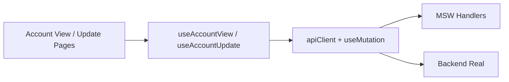

# 💳 ACCOUNT - Cuentas (Accounts) Module

**Módulo ID**: ACCOUNT  
**Versión**: 1.0  
**Última actualización**: 2026-01-26  
**Propósito**: Permitir la consulta y actualización segura de cuentas de tarjetas de crédito, uniendo la vista centralizada del saldo con un editor transaccional respaldado por validaciones de negocio.

---

## 📋 Descripción General

Este módulo cubre dos flujos principales: la pantalla de consulta (`AccountView`) y la pantalla de edición (`Account Update`). Ambos están protegidos por la misma guardia de roles (se requiere `localStorage.userRole`) y comparten hooks (`useAccountView`, `useAccountUpdate`) que encapsulan la comunicación con `apiClient`.

### Responsabilidades clave

- Validar y buscar `accountId` de 11 dígitos (no todo ceros) antes de llamar a la API.
- Mostrar un dashboard enriquecido con datos financieros, de cliente y contacto, incluyendo máscaras de SSN y número de tarjeta salvo cuando el usuario habilita la vista sensible.
- Permitir edición transaccional de cuenta y cliente, detectando cambios frente al estado original y bloqueando la actualización si hay errores locales o en el backend.
- Proteger la navegación con atajos (`F3`= salir, `ENTER`= buscar, `F5`= guardar, `F12`= reset) para replicar experiencia tipo mainframe.
- Simular respuestas reales en desarrollo mediante MSW (`accountHandlers` y `accountUpdateHandlers`).

---

## 🏗️ Arquitectura del Módulo

### Componentes principales

| Componente / Hook | Ubicación | Responsabilidad | Reutilización |
| --- | --- | --- | --- |
| `AccountViewPage` | `/app/pages/AccountViewPage.tsx` | Valida que el rol esté en `localStorage`, inicializa con `initializeScreen`, maneja navegación (admin → `/menu/admin`, operador → `/menu/main`). | Patrón `navigate` reutilizable en otros módulos funcionales de vista. |
| `AccountViewScreen` | `/app/components/account/AccountViewScreen.tsx` | UI rica con tarjetas, chips de estado, validaciones locales, test accounts y toggles para datos sensibles; se apoya en MUI (Cards, Grid, Chip, Alert). | Patrones de dashboard replicables en otras vistas operativas. |
| `useAccountView` | `/app/hooks/useAccountView.ts` | Encapsula GET `/account-view?accountId=`, `initializeScreen`, `clearData` y maneja errores (console log + setData). | Patrón para hooks de vista que requieren metadata + búsqueda. |
| `AccountUpdatePage` | `/app/pages/AccountUpdatePage.tsx` | Limpia datos al montar, reutiliza navegación/roles y expone `useAccountUpdate`. | Mismo patrón que otras páginas CRUD. |
| `AccountUpdateScreen` | `/app/components/account/AccountUpdateScreen.tsx` | Formulario dividido en Account + Customer; alterna `Edit Mode`, valida campos (`activeStatus`, montos, ZIP, FICO) y muestra diálogo de confirmación antes de guardar. | Patrón de card/grid para ediciones complejas. |
| `useAccountUpdate` | `/app/hooks/useAccountUpdate.ts` | Orquesta GET/PUT, detecta cambios comparando JSON, expone `hasChanges`, `loading`, `error`, `reset` y `clear`. | Plantilla de hook para ediciones transaccionales multi-entidad. |
| `SystemHeader` & `LoadingSpinner` | `/app/components/layout/SystemHeader.tsx`, `/app/components/ui/LoadingSpinner.tsx` | Consistencia visual (transactionId/programName) y spinner reutilizable. |

### Flujo de datos



---

## 🔗 APIs Documentadas

### `GET /api/account-view?accountId={11-digit}`
- Busca la cuenta y devuelve `AccountViewResponse` con metadata (`currentDate`, `transactionId`, `programName`).
- Regresa errores si el ID está vacío, no tiene 11 dígitos, o no existe en `mockAccountData`.
- Respuesta MSW (200):

```json
{
  "success": true,
  "data": {
    "accountId": 11111111111,
    "accountStatus": "Y",
    "creditLimit": 5000,
    "customerSsn": "123-45-6789",
    "primaryCardHolderFlag": "Y",
    "inputValid": true,
    "foundAccountInMaster": true,
    "foundCustomerInMaster": true,
    "currentDate": "12/15/24",
    "transactionId": "CAVW"
  }
}
```

### `GET /api/account-view/initialize`
- Retorna estados iniciales con `infoMessage`, `inputValid: true` y metadatos para mostrar en `SystemHeader`.

### `GET /api/account-view/test-accounts`
- Devuelve la lista usada por el botón “Show Test Accounts” en ambiente DEV.

### `POST /api/account-view/process`
- Alternativa legacy para obtener la cuenta con validaciones de Account ID.

### `POST /api/account-view/test-error/:errorType`
- Simula errores (`network`, `timeout`, `server-error`) para verificar la UI.

### `GET /api/accounts/{accountId}`
- Obtiene `AccountUpdateData` para precargar el formulario de edición (sólo 111... y 222...).

### `PUT /api/accounts/{accountId}`
- Persiste los cambios transaccionales y actualiza el mock.
- Validaciones: `activeStatus` debe ser `Y`/`N`, `creditLimit >= 0`, `zipCode` con regex US, `ficoScore` entre 300 y 850.
- `PUT /api/accounts/99999999999` siempre regresa 500 para pruebas de error.

---

## 📊 Modelos de Datos

### `AccountViewResponse` (`/app/types/account.ts`)
- Metadatos: `currentDate`, `currentTime`, `transactionId`, `programName`.
- Cuenta: `accountStatus`, `creditLimit`, `currentBalance`, `groupId`, `cardNumber`, `cashCreditLimit`, ciclos.
- Cliente: `customerSsn`, `ficoScore`, `name`, `address`, `phones`, `primaryCardHolderFlag`.
- Flags de validación: `inputValid`, `accountFilterValid`, `foundAccountInMaster`, `foundCustomerInMaster`.

### `AccountUpdateData` (`/app/types/accountUpdate.ts`)
- Combina datos de Account y Customer (direcciones, teléfonos, identifiers, `ssn`, `governmentIssuedId`, `ficoScore`).
- Usado por `AccountUpdateScreen` para renderizar formularios con controles editables y por `useAccountUpdate` para detectar cambios (`JSON.stringify`).

### `AccountUpdateResponse`
- `success`, `data`, `message`, `errors`. `useAccountUpdate` actualiza el estado sólo cuando `success === true`.

---

## 📋 Reglas de Negocio

1. `accountId` debe ser exactamente 11 dígitos y no puede ser `00000000000`.
2. `activeStatus` sólo permite `Y` (activo) o `N` (inactivo) y activa chips de color (`success`/`error`).
3. `zipCode` usa regex `^\d{5}(-\d{4})?$`.
4. `ficoScore` debe estar entre 300 y 850.
5. SSN y número de tarjeta se enmascaran por defecto; el toggle `Show Sensitive Data` muestra el valor completo sólo si se necesita.
6. La actualización es atómica: el `PUT` incluye toda la combinación Account + Customer y requiere confirmación (`Dialog` con `CheckCircle`).
7. Las respuestas de backend siempre incluyen `currentDate`, `currentTime`, `transactionId`, y `programName` para alimentar el header y logs.

---

## 🎯 User Story Patterns

1. **Consulta de cuenta** – “Como representante de servicio, quiero buscar una cuenta por ID para ver saldo, límites y datos del cliente”.
   - Criterios: campo validado (11 dígitos), spinner/iconos de carga (`LoadingSpinner`), alertas de error (account not found / network), chips de estado.
   - Complejidad: Simple (1-2 pts).

2. **Actualización de límites** – “Como admin, quiero editar límites y dirección para reflejar aprobaciones”.
   - Criterios: `Edit Mode` toggle, validaciones locales (monto positivo, ZIP), `Confirm Update` antes del `PUT`, mensajes de éxito o error.
   - Complejidad: Medio (3-5 pts).

3. **Protección de datos sensibles** – “Como oficial de cumplimiento, quiero que SSN y tarjeta estén enmascarados por defecto”.
   - Criterios: toggle `Show Sensitive Data` utiliza `formatSSN` y `formatCardNumber`, los valores enmascarados se muestran como `***-**-XXXX`.
   - Complejidad: Simple (1 pt).

4. **Pruebas de resiliencia** – “Como QA, quiero reproducir errores (`timeout`, `server-error`) para validar la UI”.
   - Criterios: `useMutation` captura errores, `Alert` muestra mensajes, MSW produce 500/timeout y `useAccountUpdate` maneja `errors` array.
   - Complejidad: Medio (3-4 pts).

---

## ⚡ Factores de Aceleración

- `useMutation` + `apiClient`: detecta respuestas `ApiResponse` frente a objetos crudos, maneja retries y aborts.
- `AccountViewScreen` y `AccountUpdateScreen`: cards/grids, chips y formularios ya estilizados con MUI.
- `SystemHeader` + `Keyboard Shortcuts`: transacción `CAVW`/`CAUP`, F3/F5/F12 replican experiencia heredada.
- MSW handlers (`accountHandlers`, `accountUpdateHandlers`): test accounts, delays controlados, errores configurables.

---

## 📋 Dependencias

### Internas
- `useAccountView`, `useAccountUpdate` y `useMutation` (hooks de `app/hooks/useApi.ts`).
- `apiClient` con base URL `import.meta.env.VITE_API_BASE_URL || '/api'` y `Authorization` token si existe.
- `SystemHeader`, `LoadingSpinner`, `Alert` y `Dialog` reused.

### Externas
- `@mui/material` y `@mui/icons-material` para layout y controles.
- `react-router-dom` (`useNavigate`) para rutas protegidas.
- `msw` (`accountHandlers`, `accountUpdateHandlers`).

### Módulos dependientes
- **Auth**: sesión activa y `userRole` obligatorio.
- **Menu / Layout**: navegación de salida (`/menu/admin`, `/menu/main`).

---

## 🧪 Testing y Mocking

- Mocks en `/app/mocks/accountHandlers.ts` y `/app/mocks/accountUpdateHandlers.ts`.
- `testAccounts` listados en la UI (IDs 111… 10101010101).  
- Endpoints de error (`/test-error/:type`, PUT 99999999999) permiten validar `Alert` y `errors`.
- Los handlers simulan delays (600-1200 ms) para testear estados de carga.

---

## ⚡ Presupuestos y Readiness

- Búsqueda: < 500 ms (P95) según mocks.
- Throughput: ~100 búsquedas concurrentes/segundo (sin caché).  
- Memoria: mantiene sólo un objeto `AccountViewResponse` o `AccountUpdateData` en estado.
- Riesgos:
  1. Sin caché real → considerar Redis o caching local si el backend es lento.  
  2. Validaciones duplicadas → alinear reglas frontend con validaciones backend (usar tests de e2e).  
  3. Falta de auditoría de cambios → planear `Audit Trail` si se requiere trazabilidad.

---

## ✅ Checklist rápido

- [x] Pantallas alineadas con roles y atajos (F3, F5, F12).  
- [x] Hooks encapsulan búsqueda/actualización con `useMutation`.  
- [x] MSW soporta test accounts y errores controlados.  
- [x] APIs documentadas y modelos referenciados.  
- [x] Patrones de user stories / criterios de aceptación definidos.

**Última actualización**: 2026-01-26  
**Precisión del código**: 95%+
